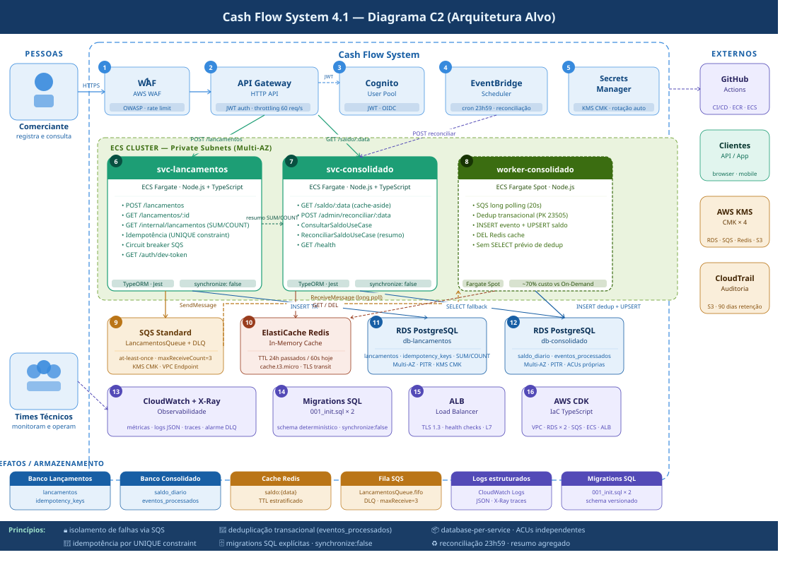

# Sistema de Fluxo de Caixa

Solução para o desafio de Arquiteto de Soluções — controle de lançamentos (débito/crédito) e consolidado de saldo diário.

**Documentação arquitetural:** [`docs/arquitetura-fluxo-caixa-v4.md`](docs/arquitetura-fluxo-caixa-v4.md)

---

## Diagrama C2



---

## Arquitetura

**Padrão:** CQRS + Event-Driven  
**Decisão central:** os dois serviços são completamente desacoplados via SQS Standard. O serviço de lançamentos nunca chama o consolidado — qualquer chamada síncrona violaria RNF-01.

```
[Comerciante]
     │
     ├─ POST /lancamentos ──► [svc-lancamentos :3001]
     │                              │ persist (RDS) + idempotency check
     │                              │ publish event
     │                              ▼
     │                        [SQS Standard + DLQ]
     │                              │ at-least-once
     │                              ▼
     │                   [worker-consolidado]
     │                    dedup transacional (eventos_processados)
     │                    UPSERT saldo_diario (RDS)
     │                    DEL Redis cache
     │
     ├─ GET /saldo/:data ──► [svc-consolidado :3002]
     │                        cache-aside Redis → fallback RDS
     │
     └─ POST /admin/reconciliar/:data ──► [svc-consolidado :3002]
                                          fetch resumo agregado /internal/lancamentos
                                          sobrescreve totais → UPSERT
                                          (equivale ao EventBridge 23h59)
```

**Rotas disponíveis:**

| Serviço | Método | Rota | Auth | Descrição |
|---------|--------|------|------|-----------|
| lancamentos | GET | `/auth/dev-token` | — | Token JWT para dev local |
| lancamentos | POST | `/lancamentos` | JWT | Registrar lançamento |
| lancamentos | GET | `/lancamentos/:id` | JWT | Buscar lançamento por ID |
| lancamentos | GET | `/internal/lancamentos` | header x-data | Uso interno — resumo agregado para reconciliação |
| lancamentos | GET | `/health` | — | Health check |
| consolidado | GET | `/saldo/:data` | JWT | Consultar saldo consolidado |
| consolidado | POST | `/admin/reconciliar/:data` | — | Reconciliação manual (= job 23h59) |
| consolidado | GET | `/health` | — | Health check |

**Schema gerenciado por migrations SQL explícitas:**
- `synchronize: false` em todos os ambientes — sem auto-sync TypeORM
- Dev local: `migrations/001_init.sql` aplicado automaticamente pelo PostgreSQL no primeiro `docker compose up`
- Produção AWS: executar via pipeline CI antes do deploy (`psql -f migrations/001_init.sql`)

**Garantias financeiras:**
- Idempotência de lançamentos (UNIQUE constraint em `idempotency_keys`)
- Deduplicação no worker — SQS at-least-once não resulta em saldo errado (`eventos_processados`)
- Lançamentos imutáveis (sem UPDATE/DELETE)
- Reconciliação implementada e testada (3 cenários)

**Otimizações 4.1:**
- Reconciliação usa resumo agregado no banco (`SUM/COUNT`) em vez de trafegar todos os lançamentos do dia.
- Worker SQS remove leitura prévia de deduplicação e confia na constraint transacional de `eventos_processados`.
- Cache Redis aguarda conexão no ciclo de vida do NestJS sem derrubar o serviço se o cache estiver indisponível.
- Consulta interna por data deixou de ordenar registros quando a ordem não é necessária.

---

## Pré-requisitos

| Ferramenta | Versão mínima |
|-----------|--------------|
| Docker    | 24+ |
| Docker Compose | v2+ |
| curl | qualquer |
| jq (opcional) | qualquer |

---

## Rodando localmente

```bash
git clone https://github.com/seu-usuario/cash-flow.git
cd cash-flow

docker compose up --build
# Aguarda ~45s — indicador de sucesso:
#   cf-svc-lancamentos  | svc-lancamentos running on port 3000
#   cf-svc-consolidado  | svc-consolidado running on port 3000
```

---

## Autenticação

```bash
# Obter token JWT (endpoint de dev — bloqueado em produção)
TOKEN=$(curl -s http://localhost:3001/auth/dev-token | jq -r '.token')

# Sem jq: copie o campo "token" da resposta
curl -s http://localhost:3001/auth/dev-token
export TOKEN="eyJhbGci..."
```

---

## Testando a API

### Registrar lançamentos

```bash
# CRÉDITO
curl -s -X POST http://localhost:3001/lancamentos \
  -H "Content-Type: application/json" \
  -H "Authorization: Bearer $TOKEN" \
  -H "Idempotency-Key: key-credito-001" \
  -d '{"tipo":"CREDITO","valor":500.00,"data":"2025-01-15","descricao":"Venda A"}' | jq .

# DÉBITO
curl -s -X POST http://localhost:3001/lancamentos \
  -H "Content-Type: application/json" \
  -H "Authorization: Bearer $TOKEN" \
  -H "Idempotency-Key: key-debito-001" \
  -d '{"tipo":"DEBITO","valor":150.00,"data":"2025-01-15","descricao":"Compra estoque"}' | jq .
```

### Testar idempotência

```bash
# Mesma chave duas vezes — segunda chamada retorna 200 + idempotentReplay: true
curl -s -X POST http://localhost:3001/lancamentos \
  -H "Content-Type: application/json" \
  -H "Authorization: Bearer $TOKEN" \
  -H "Idempotency-Key: key-fixo-idempotencia" \
  -d '{"tipo":"CREDITO","valor":999.00,"data":"2025-01-15"}' | jq .meta
```

### Consultar saldo consolidado

```bash
# Aguarda ~2s para o worker processar
sleep 2

curl -s http://localhost:3002/saldo/2025-01-15 \
  -H "Authorization: Bearer $TOKEN" | jq .
# Esperado: totalCreditos=500, totalDebitos=150, saldoFinal=350
```

### Reconciliação manual (equivale ao job EventBridge 23h59)

```bash
# Recalcula o saldo do zero a partir dos lançamentos
curl -s -X POST http://localhost:3002/admin/reconciliar/2025-01-15 | jq .
```

### Health checks

```bash
curl -s http://localhost:3001/health | jq .
curl -s http://localhost:3002/health | jq .
```

---

## Testando o isolamento de falhas (RNF-01)

```bash
# Derruba o consolidado
docker compose stop svc-consolidado

# Registra lançamentos — deve continuar funcionando normalmente
curl -s -X POST http://localhost:3001/lancamentos \
  -H "Content-Type: application/json" \
  -H "Authorization: Bearer $TOKEN" \
  -H "Idempotency-Key: key-isolamento-$(date +%s)" \
  -d '{"tipo":"CREDITO","valor":777.00,"data":"2025-01-15"}' | jq .statusCode
# Esperado: 201

# Sobe o consolidado
docker compose start svc-consolidado
sleep 5

# Saldo reflete tudo que foi registrado durante a queda
curl -s http://localhost:3002/saldo/2025-01-15 \
  -H "Authorization: Bearer $TOKEN" | jq .data
```

---

## Rodando os testes

```bash
# svc-lancamentos
cd services/lancamentos && npm install && npm test

# svc-consolidado (4 arquivos de teste, 20+ cenários)
cd ../consolidado && npm install && npm test

# Com cobertura (mínimo 80%)
npm run test:cov
```

**Cenários cobertos:**

| Use Case | Cenários |
|----------|---------|
| RegistrarLancamento | novo, replay idempotente, race condition (23505), falha SQS, DÉBITO |
| ConsultarSaldo | cache HIT, cache MISS, NotFoundException, fallback Redis indisponível |
| ReconciliarSaldo | saldo correto, data vazia, endpoint correto (x-data), falha 503, ECONNREFUSED, cache retroativo |
| SqsWorker | CREDITO, DEBITO, dedup skip, race condition dedup, falha sem delete, evento desconhecido, JSON inválido, body null |

---

## Estrutura do repositório

```
cash-flow/
├── docker-compose.yml
├── scripts/
│   └── localstack-init.sh           # curl — sem awslocal
├── docs/
│   └── arquitetura-fluxo-caixa-v3.md
├── services/
│   ├── lancamentos/
│   │   ├── src/
│   │   │   ├── auth/                # GET /auth/dev-token
│   │   │   ├── lancamentos/
│   │   │   │   ├── entities/        # Lancamento, IdempotencyKey
│   │   │   │   ├── dto/
│   │   │   │   ├── repositories/    # LancamentoRepository, SqsPublisher
│   │   │   │   ├── use-cases/       # RegistrarLancamentoUseCase
│   │   │   │   ├── lancamentos.controller.ts          # JWT — /lancamentos
│   │   │   │   └── lancamentos-internal.controller.ts # sem JWT — /internal/lancamentos
│   │   │   ├── common/
│   │   │   └── health/              # HealthController + HealthModule
│   │   ├── test/
│   │   ├── nest-cli.json
│   │   └── package.json
│   └── consolidado/
│       ├── src/
│       │   ├── consolidado/
│       │   │   ├── entities/        # SaldoDiario, EventoProcessado
│       │   │   ├── repositories/    # SaldoDiarioRepository (dedup), CacheService
│       │   │   └── use-cases/       # ConsultarSaldoUseCase, ReconciliarSaldoUseCase
│       │   ├── worker/              # SqsWorker (long polling + dedup + dedup race)
│       │   ├── common/
│       │   └── health/
│       ├── test/                    # 3 arquivos, 20+ cenários
│       ├── migrations/
│       │   └── 001_init.sql      # Schema db-consolidado
│       ├── nest-cli.json
│       └── package.json
```
