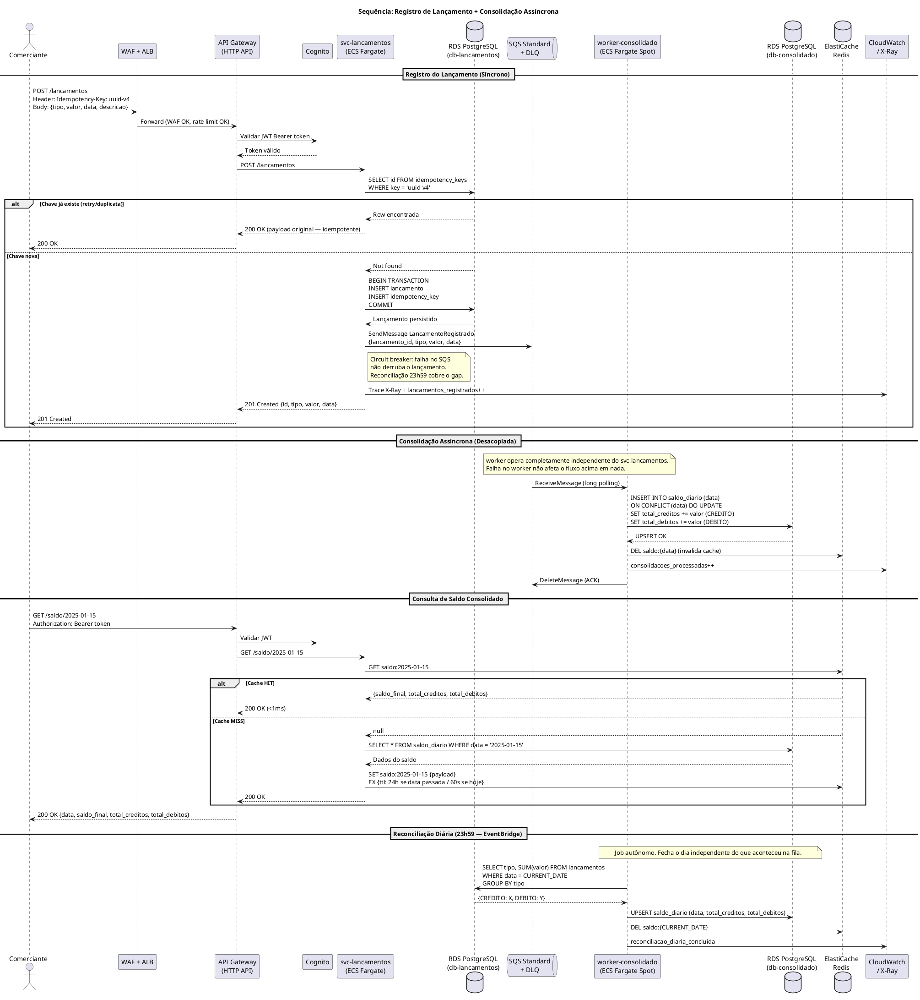

# Arquitetura de Solução — Sistema de Fluxo de Caixa

**Autor:** Cesar Contipelli Neto  
**Versão:** 4.0 (justificativa de complexidade revisada — argumentação pós-council)  
**Data:** 2026-05-28  
**Framework:** AWS Well-Architected Framework (November 2023)

> **Changelog v4.0:** Seção 13 reescrita com argumentação correta para dois bancos (ACUs independentes Aurora Serverless v2, optionality multi-tenant, opção do meio explicitada e rejeitada). Migrations SQL implementadas — `synchronize: false` em todos os ambientes. Schema determinístico via `init.sql` por serviço.

---

## Seção 1 — Análise do Problema e Requisitos

### Problema de Negócio

Um comerciante precisa controlar seu fluxo de caixa diário (lançamentos de débito e crédito) e ter acesso a um relatório consolidado de saldo por dia. O processo atual — presumivelmente manual ou em planilha — não oferece rastreabilidade, disponibilidade nem escalabilidade.

O desafio técnico traduz essa necessidade em dois serviços de negócio distintos:

1. **Controle de Lançamentos** — registro transacional de débitos e créditos em tempo real
2. **Consolidado Diário** — relatório agregado do saldo por data (total créditos − total débitos)

### Requisitos Funcionais

| ID | Requisito |
|----|-----------|
| RF-01 | Registrar lançamentos (débito/crédito) com data, valor, descrição e tipo |
| RF-02 | Consultar saldo consolidado diário |
| RF-03 | Consultar histórico de lançamentos |
| RF-04 | Relatório de saldo por data (histórico e atual) |

### Requisitos Não-Funcionais

| ID | Requisito | Meta |
|----|-----------|------|
| RNF-01 | Isolamento de falhas: lançamentos UP mesmo com consolidado DOWN | Obrigatório — requisito inegociável |
| RNF-02 | Throughput do consolidado em pico | 50 req/s com ≤5% de perda |
| RNF-03 | Disponibilidade do serviço de lançamentos | 99,9% (≤8,7h downtime/ano) |
| RNF-04 | Latência de lançamento | p99 ≤ 200ms |
| RNF-05 | Latência de consulta consolidada | p99 ≤ 200ms |
| RNF-06 | Consistência eventual do consolidado | Tolerada (segundos a minutos) |
| RNF-07 | Idempotência de lançamentos | Obrigatória (chave por requisição) |
| RNF-08 | Auditabilidade | Todos os lançamentos rastreáveis (imutáveis) |
| RNF-09 | Segurança | Autenticação JWT + autorização por escopo |

### Decisão Central: Por que assíncrono?

O requisito RNF-01 é o mais crítico e dita toda a arquitetura. A tentação é fazer uma chamada síncrona: lançamento registra e chama o consolidado para atualizar o saldo. Simples — mas se o consolidado estiver fora do ar, o lançamento trava junto. Violação direta do requisito.

A solução é uma fila. O serviço de lançamentos registra no banco, publica um evento em SQS, e retorna 201 ao comerciante. O consolidado consume quando puder. Se estiver fora do ar por 2 horas, os eventos ficam esperando. Quando volta, processa tudo. O comerciante nunca sentiu nada.

**Qualquer chamada síncrona entre os dois serviços viola RNF-01. Não existe meio-termo aqui.**

---

## Seção 2 — Domínios Funcionais e Capacidades de Negócio

### Fatos Extraídos do Desafio

| # | Fato |
|---|------|
| F-001 | Exatamente dois serviços: controle de lançamentos e consolidado diário |
| F-002 | Lançamentos são débitos ou créditos |
| F-003 | Comerciante precisa de relatório com saldo diário consolidado |
| F-004 | Serviço de lançamentos NÃO deve ficar indisponível se consolidado cair |
| F-005 | Pico de 50 requisições por segundo no consolidado |
| F-006 | Taxa de perda máxima no pico: 5% das requisições |

### Inferências Arquiteturais

| # | Inferência | Confiança |
|---|-----------|-----------|
| I-001 | Padrão CQRS + Event-Driven — único que atende RNF-01 sem chamada síncrona | ALTA |
| I-002 | Comunicação via SQS — desacoplamento gerenciado, sem infra adicional | ALTA |
| I-003 | Cache Redis para o consolidado — 50 req/s com dados de baixa mutabilidade | ALTA |
| I-004 | Database-per-service — bancos separados para não acoplar no nível de dados | ALTA |
| I-005 | Reconciliação batch às 23h59 — garante consistência mesmo com falhas na fila | ALTA |
| I-006 | Sistema single-tenant para este desafio — "um comerciante" no enunciado | MÉDIA |
| I-007 | Lançamentos imutáveis após criação — audit trail financeiro; estornos são novos lançamentos | MÉDIA |
| I-008 | TypeScript/NestJS — type safety em operações financeiras, ecossistema rico | MÉDIA |

### Mapa de Domínios

```
┌─────────────────────────────────────────────────────────────────────┐
│                    SISTEMA DE FLUXO DE CAIXA                        │
│                                                                     │
│  ┌───────────────────────────┐   ┌───────────────────────────────┐  │
│  │   DOMÍNIO: LANÇAMENTOS    │   │   DOMÍNIO: CONSOLIDADO        │  │
│  │                           │   │                               │  │
│  │ Capacidades:              │   │ Capacidades:                  │  │
│  │ • Registrar débito        │──▶│ • Agregar lançamentos por dia │  │
│  │ • Registrar crédito       │   │ • Calcular saldo diário       │  │
│  │ • Validar idempotência    │   │ • Disponibilizar relatório    │  │
│  │ • Consultar histórico     │   │ • Reconciliar consolidado     │  │
│  │                           │   │                               │  │
│  └───────────────────────────┘   └───────────────────────────────┘  │
│              │                                  ▲                   │
│              │        Evento de domínio         │                   │
│              └──────── LancamentoRegistrado ────┘                   │
│                         (SQS Standard + DLQ)                        │
└─────────────────────────────────────────────────────────────────────┘
```

### Bounded Contexts

**Lançamentos (Write Side)**
- Entidade: `Lancamento` (id, tipo, valor, data, descricao, idempotencyKey, createdAt)
- Regras: valor > 0; tipo ∈ {DEBITO, CREDITO}; idempotência por `idempotencyKey`
- Banco próprio: RDS PostgreSQL (isolado)
- Saída: evento `LancamentoRegistrado` publicado em SQS Standard

**Consolidado (Read Side / Projeção)**
- Entidade: `SaldoDiario` (data, totalDebitos, totalCreditos, saldoFinal)
- Banco próprio: RDS PostgreSQL (isolado — database-per-service)
- Atualizado de forma assíncrona via consumo da fila + reconciliação batch às 23h59
- Servido com cache Redis para consultas em alta frequência

---

## Seção 3 — Visão Geral da Solução AWS (Well-Architected)

### Padrão Arquitetural: CQRS + Event-Driven + Clean Architecture

**CQRS:** escrita (lançamentos) e leitura (consolidado) têm modelos de dados, escala e requisitos completamente distintos. Segregar os paths elimina acoplamento e permite escalar independentemente.

**Event-Driven:** o evento `LancamentoRegistrado` desacopla os dois domínios. O serviço de lançamentos não conhece o consolidado — apenas publica.

**Clean Architecture:** cada serviço organizado em camadas (domain → application → infrastructure) para testabilidade e manutenibilidade.

### Compute: ECS Fargate (não EKS)

Para um sistema com 2 serviços, ECS Fargate é o ponto ótimo. EKS seria overengineering — o overhead operacional de cluster Kubernetes não se justifica aqui. Lambda tem cold start que impacta a latência da API síncrona de lançamentos.

O Consumer do SQS (worker-consolidado) **é um candidato legítimo a Lambda**: stateless, event-driven, sem requisito de latência síncrona. Ambas as abordagens são válidas; ECS Fargate Spot mantém consistência de stack e simplifica observabilidade.

### Well-Architected Framework

| Pilar | Decisão | Score |
|-------|---------|-------|
| **Excelência Operacional** | IaC AWS CDK (TypeScript); CI/CD GitHub Actions; CloudWatch dashboards; logs JSON estruturados | ★★★★☆ |
| **Segurança** | JWT authorizer; Task Role por serviço; KMS CMK; Secrets Manager; WAF; VPC isolation | ★★★★★ |
| **Confiabilidade** | Serviços desacoplados; SQS retry + DLQ; Multi-AZ RDS + Redis; ECS auto-scaling; reconciliação batch | ★★★★★ |
| **Eficiência de Desempenho** | Redis cache-aside (90%+ hit rate); ECS target tracking; RDS read replica; connection pooling | ★★★★☆ |
| **Otimização de Custos** | Fargate Spot para worker; RDS t3.micro Multi-AZ; SQS gerenciado; ~$148/mês | ★★★☆☆ |
| **Sustentabilidade** | Sem EC2 ociosos; auto-scaling down; Fargate right-sizing | ★★★★☆ |

### Topologia de Rede

```
VPC (10.0.0.0/16) — sa-east-1
│
├── Public Subnets (10.0.0.0/24, 10.0.1.0/24) — AZ-a, AZ-b
│   ├── Internet Gateway
│   ├── NAT Gateway (por AZ)
│   └── ALB (internet-facing)
│
├── Private Subnets (10.0.10.0/24, 10.0.11.0/24) — AZ-a, AZ-b
│   ├── ECS Tasks — svc-lancamentos
│   ├── ECS Tasks — svc-consolidado-api
│   └── ECS Tasks — worker-consolidado
│
└── Isolated Subnets (10.0.20.0/24, 10.0.21.0/24) — AZ-a, AZ-b
    ├── RDS PostgreSQL — banco lançamentos
    ├── RDS PostgreSQL — banco consolidado
    └── ElastiCache Redis
```

---

## Seção 4 — Componentes AWS e Relação com o Problema

**Amazon API Gateway (HTTP API)**
- Relação: ponto de entrada único; JWT authorizer valida token antes de qualquer compute; throttling nativo em 60 req/s (20% headroom sobre o pico de 50)
- Well-Architected: Segurança (autenticação centralizada), Confiabilidade (throttling evita cascata)

**AWS ECS Fargate — svc-lancamentos**
- Relação: processa POST de lançamentos, valida idempotência via UNIQUE constraint, persiste em RDS próprio e publica evento em SQS
- Well-Architected: Excelência Operacional (sem gerenciamento de SO), Eficiência (escala por CPU)

**AWS ECS Fargate — svc-consolidado-api**
- Relação: serve GET /saldo/{data}; resposta vem de Redis (cache-aside); fallback para RDS consolidado se cache miss
- Well-Architected: Eficiência (latência µs do Redis), Confiabilidade (fallback garantido)

**AWS ECS Fargate Spot — worker-consolidado**
- Relação: consome SQS, agrega lançamentos em RDS consolidado, invalida cache Redis; tolerante a interrupção Spot porque SQS retém a mensagem
- Well-Architected: Otimização de Custos (~70% mais barato), Confiabilidade (DLQ para falhas, Spot-safe por design)

**Amazon SQS Standard Queue + DLQ**
- Relação: canal de desacoplamento entre os domínios; entrega at-least-once; maxReceiveCount=3 antes de mover para DLQ; Visibility Timeout evita processamento duplicado em janelas normais
- **Por que Standard e não FIFO:** ordering por data não é necessário aqui — o consolidado usa UPSERT idempotente; FIFO custa mais e tem throughput limitado (3.000 msg/s por MessageGroup, desnecessário para este volume)
- **Deduplicação explícita no worker (crítico para dados financeiros):** SQS Standard é at-least-once — o mesmo evento pode ser entregue mais de uma vez (ex: falha antes do DeleteMessage, re-entrega após Visibility Timeout). Sem controle de deduplicação, processar o mesmo lançamento duas vezes resultaria em saldo incorreto. Solução implementada: tabela `eventos_processados` com UNIQUE constraint em `lancamento_id`. O worker verifica antes de aplicar; o INSERT na tabela está na mesma transação do UPSERT no saldo (atômico). Race condition entre workers simultâneos é tratada via QueryFailedError 23505.
- Well-Architected: Confiabilidade (fault isolation + deduplicação financeira), Integridade (DLQ garante zero perda)

**Amazon RDS PostgreSQL — dois bancos separados**
- Relação: database-per-service — `db-lancamentos` e `db-consolidado` são instâncias independentes. Banco compartilhado acoplaria os dois serviços no nível de dados, quebrando o princípio de isolamento
- Configuração: db.t3.micro, Multi-AZ, PITR habilitado, storage encryption com KMS CMK
- Well-Architected: Confiabilidade (failover automático Multi-AZ), Segurança (CMK por banco)

**Amazon ElastiCache Redis**
- Relação: cache-aside do saldo diário com estratégia de TTL por tipo de dado:
  - Saldos de **dias passados**: imutáveis → TTL 24h
  - Saldo do **dia corrente**: mutável → TTL 60s + invalidação por evento quando worker processa
- Cache hit rate esperado: >90% para queries de dias passados
- Well-Architected: Eficiência de Desempenho (latência <1ms vs. dezenas de ms no RDS)

**Amazon EventBridge Scheduler — Reconciliação 23h59**
- Relação: dispara job de reconciliação ao final de cada dia chamando `POST /admin/reconciliar/{data}` no svc-consolidado. O use case `ReconciliarSaldoUseCase` busca lançamentos via `GET /internal/lancamentos` (rota sem JWT, interna ao cluster), recalcula saldo do zero e faz UPSERT em `saldo_diario`. Garante consistência mesmo que eventos SQS tenham ido para DLQ ou circuit breaker tenha absorvido falha de publish.
- **Implementado e testável localmente:** `POST /admin/reconciliar/:data` — dispensa EventBridge em dev, comportamento idêntico
- Well-Architected: Confiabilidade (mecanismo de fechamento do dia à prova de falhas assíncronas)

**AWS Secrets Manager**
- Relação: connection strings de RDS e Redis injetadas via ECS Secrets no Task Definition; sem credenciais em variáveis de ambiente ou código
- Well-Architected: Segurança (rotação automática integrada com RDS)

**Amazon CloudWatch + X-Ray**
- Relação: trace distribuído API Gateway → svc-lancamentos → RDS → SQS → worker; alarme em DLQ > 0; dashboard unificado de SLIs
- Well-Architected: Excelência Operacional (visibilidade de ponta a ponta)

**AWS WAF**
- Relação: AWSManagedRulesCommonRuleSet (OWASP Top 10) + rate limiting por IP no API Gateway
- Well-Architected: Segurança (proteção de borda)

**AWS CDK (IaC)**
- Relação: toda a infraestrutura como código em TypeScript — mesmo stack dos serviços. `cdk diff` para revisão de mudanças antes de deploy
- Well-Architected: Excelência Operacional (infra reproduzível, versionada no repositório)

---

## Seção 5 — Segurança e Conformidade

### Controle de Acesso

- **API Gateway JWT Authorizer**: valida token emitido por Cognito User Pool (ou custom JWT); sem token → 401 direto no gateway, sem consumir compute dos serviços
- **ECS Task Roles (least privilege)**: `task-role-lancamentos` com permissão apenas em SQS e KMS; `task-role-worker` apenas em SQS + Secrets Manager; sem credenciais estáticas
- **Idempotência por UNIQUE constraint no banco**: não Redis lock — banco oferece consistência forte mesmo com múltiplos pods concorrentes. UNIQUE constraint em `idempotency_key` dentro da mesma transação é a solução correta para idempotência transacional financeira

### Proteção de Dados

- **RDS**: `StorageEncrypted = true` com CMK `alias/prod-rds-lancamentos-cmk` e `alias/prod-rds-consolidado-cmk` (chave separada por banco)
- **SQS**: SSE com KMS CMK dedicado `alias/prod-sqs-cmk`
- **ElastiCache**: `in-transit-encryption = true` + `at-rest-encryption = true`
- **TLS 1.3**: ALB policy `ELBSecurityPolicy-TLS13-1-2-2021-06`; RDS `rds.force_ssl = 1`

### Imutabilidade dos Lançamentos

Sem UPDATE/DELETE na tabela `lancamentos`. Estornos são novos lançamentos com tipo oposto. Isso garante audit trail completo e rastreabilidade fiscal. `created_at` com `DEFAULT NOW()` e sem possibilidade de override.

### Containers

- Imagem base: `node:20-alpine` (mínima)
- Usuário não-root: `USER node` no Dockerfile
- `readonlyRootFilesystem: true` no ECS Task Definition
- ECR Enhanced Scanning (Inspector v2) no pipeline CI

### LGPD

Os dados do sistema (valor, tipo, data, descrição) não são dados pessoais sensíveis por natureza. Controles aplicados:
- Sem PII em logs — `X-Correlation-ID` em vez de IDs de negócio nos logs de aplicação
- TTL de 90 dias em CloudWatch Logs
- Retenção de 5 anos nos dados transacionais (referência fiscal brasileira)

### Checklist de Segurança (resumo dos controles projetados)

| Categoria | Controles |
|-----------|-----------|
| Identidade | JWT Bearer em todas as rotas; expiração curta (15min access / 7d refresh); Task Roles por serviço sem wildcard |
| Dados em trânsito | TLS 1.2+ externo; TLS interno RDS; SQS HTTPS + SSE; HSTS |
| Dados em repouso | KMS CMK por serviço (RDS, SQS, Redis); RDS backup criptografado 7 dias |
| Rede | VPC 3 tiers; SGs restritivos; NACLs em subnet isolada; VPC Endpoints (SQS, STS, Secrets Manager) |
| API | WAF OWASP rules; rate limiting por IP; class-validator nos DTOs; TypeORM parameterized queries; idempotency-key |
| Auditoria | CloudTrail todas as regiões; access logs API GW; logs JSON estruturados; lançamentos imutáveis |

---

## Seção 6 — Análise de Riscos

| Risco | Probabilidade | Impacto | Mitigação |
|-------|--------------|---------|-----------|
| Consolidado Service fica indisponível | ALTA | Zero para lançamentos; Alto para consultas | SQS retém eventos; lançamentos nunca perdem dados |
| Inconsistência entre lançamentos e consolidado | MÉDIA | Alto | Reconciliação batch 23h59 + DLQ com alerta imediato |
| Pico > 50 req/s no consolidado | MÉDIA | Médio (5% perda tolerada) | API GW throttling 60 req/s + Redis >90% hit rate + ECS auto-scaling |
| Lançamento duplicado (retry de rede) | MÉDIA | Alto (dado financeiro) | UNIQUE constraint em `idempotency_key` + transação ACID |
| Perda de evento SQS | BAIXA | Alto | at-least-once + DLQ após 3 tentativas + reconciliação batch |
| Janela de falha COMMIT → SendMessage | BAIXA | Médio | Reconciliação batch fecha o dia corretamente; Outbox Pattern como evolução futura |
| Drift de timezone | BAIXA | Médio | Todos os timestamps em UTC; `data_lancamento` como DATE explícita |

---

## Seção 7 — Diagramas PlantUML

### C1 — Diagrama de Contexto

```plantuml
@startuml C1_Context_FluxoCaixa
!include https://raw.githubusercontent.com/plantuml-stdlib/C4-PlantUML/master/C4_Context.puml

LAYOUT_WITH_LEGEND()

title C1 — Contexto do Sistema: Fluxo de Caixa

Person(comerciante, "Comerciante", "Registra lançamentos e consulta saldo diário via browser ou app mobile")
Person(admin, "Administrador", "Monitora operação, configura alertas e acessa logs de auditoria")

System(sistema_fluxo, "Sistema de Fluxo de Caixa", "Controle de lançamentos (débito/crédito) e consolidado de saldo diário")

System_Ext(cognito, "Amazon Cognito", "Emissão e validação de tokens JWT")
System_Ext(monitoring, "CloudWatch / X-Ray", "Observabilidade: métricas, logs, traces distribuídos")
System_Ext(auditoria, "CloudTrail + S3", "Auditoria de chamadas de API e rastreabilidade")

Rel(comerciante, sistema_fluxo, "POST /lancamentos, GET /saldo/{data}", "HTTPS / REST + JWT")
Rel(admin, sistema_fluxo, "Monitora dashboards e alarmes")
Rel(sistema_fluxo, cognito, "Valida token JWT", "HTTPS / OIDC")
Rel(sistema_fluxo, monitoring, "Envia métricas, logs e traces", "SDK / OTEL")
Rel(sistema_fluxo, auditoria, "Registra auditoria de API calls", "CloudTrail integrado")

@enduml
```

---

### C2 — Diagrama de Contêineres

```plantuml
@startuml C2_Containers_FluxoCaixa
!include https://raw.githubusercontent.com/plantuml-stdlib/C4-PlantUML/master/C4_Container.puml

LAYOUT_WITH_LEGEND()

title C2 — Contêineres AWS: Sistema de Fluxo de Caixa

Person(comerciante, "Comerciante", "Browser / App Mobile")

System_Boundary(aws_account, "AWS Account — sa-east-1") {

    Container(waf, "WAF", "AWS WAF", "Proteção OWASP Top 10, rate limiting por IP")
    Container(alb, "ALB", "Application Load Balancer", "Roteamento L7, terminação TLS 1.3")
    Container(api_gw, "API Gateway", "HTTP API", "JWT authorizer (Cognito), throttling 60 req/s, roteamento por path")
    Container(cognito, "Amazon Cognito", "User Pool", "Emissão e validação de tokens JWT")
    Container(eventbridge, "EventBridge Scheduler", "Cron 23h59", "Dispara reconciliação diária do consolidado")

    System_Boundary(ecs_cluster, "ECS Cluster (Private Subnets — Multi-AZ)") {
        Container(svc_lancamentos, "svc-lancamentos", "ECS Fargate / Node.js + TypeScript", "Registra lançamentos, valida idempotência, publica evento")
        Container(svc_consolidado_api, "svc-consolidado-api", "ECS Fargate / Node.js + TypeScript", "Serve saldo diário com cache-aside Redis")
        Container(worker_consolidado, "worker-consolidado", "ECS Fargate Spot / Node.js + TypeScript", "Consome SQS, agrega lançamentos, atualiza saldo diário")
    }

    Container(sqs_standard, "SQS Standard + DLQ", "LancamentosQueue", "Desacoplamento assíncrono. maxReceiveCount=3. KMS CMK.")
    Container(db_lancamentos, "RDS PostgreSQL", "db-lancamentos — Multi-AZ", "Fonte de verdade dos lançamentos. Banco exclusivo do svc-lancamentos.")
    Container(db_consolidado, "RDS PostgreSQL", "db-consolidado — Multi-AZ", "Saldos diários. Banco exclusivo do domínio consolidado.")
    Container(redis, "ElastiCache Redis", "In-Memory Cache", "Cache saldo diário. TTL 24h dias passados / 60s dia corrente.")
    Container(secrets_mgr, "Secrets Manager", "Secret Store", "Connection strings RDS e Redis. Rotação automática.")
    Container(cloudwatch, "CloudWatch + X-Ray", "Observabilidade", "Métricas, logs JSON, traces distribuídos, alarme DLQ")
}

Rel(comerciante, waf, "HTTPS", "TLS 1.3")
Rel(waf, alb, "HTTPS — tráfego validado")
Rel(alb, api_gw, "HTTP interno")
Rel(api_gw, cognito, "Valida JWT token")
Rel(api_gw, svc_lancamentos, "POST /lancamentos", "HTTP")
Rel(api_gw, svc_consolidado_api, "GET /saldo/{data}", "HTTP")
Rel(svc_lancamentos, db_lancamentos, "INSERT lancamento + idempotency check", "JDBC/pg TLS")
Rel(svc_lancamentos, sqs_standard, "SendMessage LancamentoRegistrado")
Rel(svc_consolidado_api, redis, "GET saldo:{data} — cache-aside")
Rel(svc_consolidado_api, db_consolidado, "SELECT saldo_diario — fallback cache miss")
Rel(worker_consolidado, sqs_standard, "ReceiveMessage — long polling")
Rel(worker_consolidado, db_consolidado, "UPSERT saldo_diario")
Rel(worker_consolidado, redis, "DEL saldo:{data} — invalida cache")
Rel(eventbridge, worker_consolidado, "Trigger reconciliação 23h59")
Rel(svc_lancamentos, secrets_mgr, "Obtém credenciais RDS", "Task Role")
Rel(svc_consolidado_api, secrets_mgr, "Obtém credenciais Redis", "Task Role")
Rel(worker_consolidado, secrets_mgr, "Obtém credenciais", "Task Role")
Rel(svc_lancamentos, cloudwatch, "Métricas e traces")
Rel(worker_consolidado, cloudwatch, "Métricas e traces")

@enduml
```

---

### C3 — Componentes Internos: svc-lancamentos

```plantuml
@startuml C3_Components_SvcLancamentos
!include https://raw.githubusercontent.com/plantuml-stdlib/C4-PlantUML/master/C4_Component.puml

LAYOUT_WITH_LEGEND()

title C3 — Componentes Internos: svc-lancamentos (Clean Architecture)

Container_Boundary(svc_lancamentos, "svc-lancamentos (ECS Fargate)") {

    Component(http_handler, "HTTP Handler", "NestJS Controller", "Recebe requisição HTTP, valida schema (class-validator), extrai Idempotency-Key do header")
    Component(lancamento_usecase, "RegistrarLancamentoUseCase", "Application Layer", "Orquestra: verifica idempotência → persiste → publica evento. Transação atômica.")
    Component(idempotency_repo, "IdempotencyRepository", "Infrastructure", "SELECT/INSERT em idempotency_keys. UNIQUE constraint garante exatamente uma inserção.")
    Component(lancamento_repo, "LancamentoRepository", "Infrastructure", "INSERT imutável em lancamentos. TypeORM com parameterized queries.")
    Component(event_publisher, "EventPublisher", "Infrastructure", "SendMessage para SQS Standard. MessageGroupId = data do lançamento.")
    Component(circuit_breaker, "CircuitBreaker (SQS)", "Infrastructure", "Falha no SQS não propaga para o handler. Lançamento persiste; reconciliação batch cobre o gap.")
    Component(health_check, "HealthCheck Handler", "GET /health", "Verifica conectividade RDS. 200 se saudável, 503 se não.")
}

Container_Ext(api_gw_ext, "API Gateway", "Roteia requisições")
Container_Ext(db_lancamentos_ext, "RDS PostgreSQL — db-lancamentos", "Persistência")
Container_Ext(sqs_ext, "SQS Standard", "Mensageria")
Container_Ext(cloudwatch_ext, "CloudWatch / X-Ray", "Observabilidade")

Rel(api_gw_ext, http_handler, "POST /lancamentos + Idempotency-Key header", "HTTP")
Rel(http_handler, lancamento_usecase, "Chama use case com DTO validado")
Rel(lancamento_usecase, idempotency_repo, "Verifica se idempotency_key já existe")
Rel(lancamento_usecase, lancamento_repo, "Persiste lançamento (imutável)")
Rel(lancamento_usecase, event_publisher, "Publica LancamentoRegistrado")
Rel(event_publisher, circuit_breaker, "Wrappado com circuit breaker")
Rel(circuit_breaker, sqs_ext, "SendMessage")
Rel(idempotency_repo, db_lancamentos_ext, "SQL — tabela idempotency_keys")
Rel(lancamento_repo, db_lancamentos_ext, "SQL — tabela lancamentos")
Rel(http_handler, cloudwatch_ext, "Trace X-Ray + log estruturado JSON")

@enduml
```

---

### Diagrama de Sequência — Registro de Lançamento + Consolidação



---

## Seção 8 — Arquitetura de Transição (Legado)

### Cenário: migração de planilha / sistema manual para esta arquitetura

```
FASE 0 (Atual — Legado)          FASE 1 (Shadow Mode)           FASE 2 (Cutover)
─────────────────────           ──────────────────────         ──────────────────
Planilha Excel /                Nova API recebe                Sistema AWS ativo
Sistema local sem               lançamentos em paralelo        100% — legado
API ou integração               Legado ainda opera             descomissionado
                                Comparador valida              5 dias úteis sem
                                consistência dos saldos        divergência → GO
```

**Passos concretos:**

1. **Seed inicial**: script lê histórico do legado (CSV/Excel), insere em `lancamentos` com `source='migrado'`, gera `saldo_diario` retroativo via batch
2. **Shadow Mode (2 semanas)**: ambos os sistemas recebem lançamentos; comparador automático valida divergências antes do go-live
3. **Strangler Fig via API Gateway**: se o legado tiver API, API Gateway roteia gradualmente via stage variables (canary deployment)
4. **Cut-over**: legado desativado após 5 dias úteis consecutivos sem divergência

---

## Seção 9 — Monitoramento e Observabilidade

### Stack

| Ferramenta | Uso |
|-----------|-----|
| **CloudWatch Metrics** | Latência HTTP p50/p95/p99; ECS CPU/Memory; SQS ApproximateNumberOfMessages; DLQ depth |
| **CloudWatch Logs** | Logs estruturados JSON (correlation-id, duration, status) com Log Insights |
| **X-Ray** | Trace distribuído: API Gateway → svc-lancamentos → RDS → SQS → worker |
| **CloudWatch Alarms** | DLQ > 0 → SNS → alerta; Latência p99 > 200ms → alerta; ECS task failures > 2 → alerta |
| **CloudWatch Dashboard** | Throughput de lançamentos, saldo consultado/hora, profundidade da fila, hit rate do cache |

### SLIs e SLOs

```
lancamentos_por_minuto         — SLI de throughput de negócio
lancamento_latency_p99         — SLO: ≤200ms
consolidacao_lag_seconds       — tempo entre lançamento e consolidado atualizado
cache_hit_rate                 — SLO: ≥90% em pico
dlq_message_count              — SLO: 0 (qualquer valor dispara alerta imediato)
saldo_query_latency_p99        — SLO: ≤200ms
reconciliacao_diaria_status    — SLO: concluída com sucesso até 00h01
```

---

## Seção 10 — Estimativa de Custos (AWS sa-east-1)

> Estimativa para ambiente de produção pequeno. Valores aproximados USD/mês.

| Serviço | Configuração | USD/mês |
|---------|-------------|---------|
| ECS Fargate — svc-lancamentos | 0.25 vCPU / 0.5GB / 2 tasks On-Demand 24x7 | ~$15 |
| ECS Fargate — svc-consolidado-api | 0.25 vCPU / 0.5GB / 2 tasks On-Demand 24x7 | ~$15 |
| ECS Fargate Spot — worker | 0.25 vCPU / 0.5GB / 1–3 tasks Spot | ~$3 |
| RDS PostgreSQL — db-lancamentos | db.t3.micro, Multi-AZ | ~$35 |
| RDS PostgreSQL — db-consolidado | db.t3.micro, Multi-AZ | ~$35 |
| ElastiCache Redis | cache.t3.micro, 1 node | ~$15 |
| SQS Standard + DLQ | <1M mensagens/mês | ~$1 |
| API Gateway HTTP API | <1M req/mês | ~$3,50 |
| ALB | 1 LCU estimado | ~$22 |
| Secrets Manager | 4 segredos | ~$2 |
| CloudWatch + X-Ray | Métricas, logs 5GB/mês | ~$8 |
| WAF | 1 Web ACL + regras managed | ~$10 |
| NAT Gateway | 10GB/mês | ~$5 |
| **Total estimado** | | **~$170/mês** |

> **Otimização potencial:** Savings Plans ou Reserved Instances (1 ano) reduzem RDS e ECS em ~30–40%, levando o custo a ~$120/mês. Worker em Fargate Spot já embutido — ~70% mais barato vs. On-Demand.

---

## Seção 11 — Questões em Aberto

| # | Questão | Decisão Padrão Adotada |
|---|---------|----------------------|
| OQ-001 | Multi-tenant ou single-tenant? | Single-tenant (extensível via `comerciante_id` como partition key) |
| OQ-002 | Timezone dos lançamentos? | UTC — `data_lancamento` como DATE explícita |
| OQ-003 | Lançamentos retroativos permitidos? | Sim, com invalidação de cache por data |
| OQ-004 | Saldo inicial zero ou pré-existente? | Zero (sem saldo anterior ao primeiro lançamento) |
| OQ-005 | Retenção de dados históricos? | 5 anos (referência fiscal brasileira) |
| OQ-006 | Consolidado realtime ou batch? | Híbrido: evento incremental via SQS + batch de fechamento às 23h59 |
| OQ-007 | SLA de latência p99 para lançamentos? | <200ms p99 (inferido como razoável para operação financeira interativa) |

---

## Seção 12 — Evoluções Futuras

**1. Outbox Pattern para garantia de entrega do evento**
Janela de falha entre COMMIT Aurora e SendMessage SQS: se a rede cair entre os dois, o lançamento persiste mas o evento se perde. Outbox resolve: escreve o evento em tabela `outbox` na mesma transação; relay process publica para SQS e marca como publicado. A reconciliação 23h59 mitiga o risco na versão atual.

**2. Reprocessamento inteligente na DLQ**
Hoje requer intervenção manual. Evolução: Lambda que consome DLQ com backoff exponencial, reprocessa falhas transientes automaticamente, e alerta apenas para falhas estruturais (dados corrompidos).

**3. Multi-tenancy**
`comerciante_id` como partition key em todas as tabelas. Cognito Claims carregam o ID — propagado como contexto em toda a cadeia. SQS MessageGroupId = `comerciante_id:data`.

**4. Conciliação bancária automática**
API do banco do comerciante → importação de extrato → conciliação automática contra lançamentos registrados no sistema. Identifica divergências automaticamente.

**5. Webhooks de notificação**
Após worker processar consolidado, EventBridge dispara webhook para o comerciante ("saldo do dia X atualizado: R$ Y"). Integração com sistemas externos sem polling.

---

## Apêndice — ADRs

| ADR | Decisão | Alternativas | Motivo |
|-----|---------|-------------|--------|
| ADR-001 | Cloud: AWS | Azure, GCP | Maior adoção no mercado brasileiro; SQS/EventBridge nativos; ecossistema maduro |
| ADR-002 | Runtime: Node.js 20 + TypeScript + NestJS | Java/Spring, Go, Python | Type safety em operações financeiras; NestJS para DI e estrutura; ecossistema rico (Jest, TypeORM, class-validator) |
| ADR-003 | Banco: RDS PostgreSQL (dois separados) | DynamoDB, banco único compartilhado | ACID para idempotência transacional; DECIMAL nativo (sem float rounding); database-per-service para isolamento real |
| ADR-004 | Fila: SQS Standard + DLQ | SQS FIFO, Kafka MSK | FIFO desnecessário: consolidado usa UPSERT idempotente; ordering não é requisito; SQS Standard é mais barato e sem limite de throughput por MessageGroup |
| ADR-005 | Cache: ElastiCache Redis | Memcached, DAX | Cache-aside com controle de invalidação por data; TTL estratificado (24h passados / 60s corrente); Memcached sem TTL por key |
| ADR-006 | Compute: ECS Fargate | EKS, Lambda | EKS: overengineering para 2 serviços; Lambda: cold start impacta API síncrona; Fargate: equilíbrio custo/operação |
| ADR-007 | IaC: AWS CDK (TypeScript) | Terraform, SAM | Mesmo stack do serviço; type safety nas definições de infra; `cdk diff` para revisão; infra no mesmo repositório |

---

## Apêndice — Modelo de Dados

```sql
-- === db-lancamentos ===

CREATE TABLE lancamentos (
    id              UUID PRIMARY KEY DEFAULT gen_random_uuid(),
    tipo            VARCHAR(7) NOT NULL CHECK (tipo IN ('DEBITO', 'CREDITO')),
    valor           NUMERIC(15,2) NOT NULL CHECK (valor > 0),
    data            DATE NOT NULL,
    descricao       TEXT,
    created_at      TIMESTAMPTZ NOT NULL DEFAULT NOW(),
    source          VARCHAR(20) DEFAULT 'api'  -- 'api' | 'migrado'
    -- Sem UPDATE/DELETE. Lançamentos são imutáveis.
);

CREATE INDEX idx_lancamentos_data ON lancamentos(data);

CREATE TABLE idempotency_keys (
    key             VARCHAR(255) PRIMARY KEY,  -- UNIQUE garante exatamente uma inserção
    lancamento_id   UUID REFERENCES lancamentos(id),
    created_at      TIMESTAMPTZ NOT NULL DEFAULT NOW()
);

-- === db-consolidado ===

CREATE TABLE saldo_diario (
    data            DATE PRIMARY KEY,
    total_creditos  NUMERIC(15,2) NOT NULL DEFAULT 0,
    total_debitos   NUMERIC(15,2) NOT NULL DEFAULT 0,
    saldo_final     NUMERIC(15,2) GENERATED ALWAYS AS (total_creditos - total_debitos) STORED,
    updated_at      TIMESTAMPTZ NOT NULL DEFAULT NOW()
);

-- Worker usa UPSERT para idempotência no processamento:

-- Controle de deduplicação do worker (SQS at-least-once)
CREATE TABLE eventos_processados (
    lancamento_id   UUID PRIMARY KEY,
    event_type      VARCHAR(50) NOT NULL,
    processed_at    TIMESTAMPTZ NOT NULL DEFAULT NOW()
);
-- INSERT INTO saldo_diario (...) ON CONFLICT (data) DO UPDATE SET ...
```

---

## Apêndice — Roadmap de Implementação

| Fase | Escopo | Duração | Entregável |
|------|--------|---------|------------|
| **Sprint 1** | svc-lancamentos (API + RDS + idempotência + testes Jest) | 1 semana | POST/GET /lancamentos funcionando com cobertura ≥80% |
| **Sprint 2** | worker-consolidado (Consumer SQS + UPSERT) + svc-consolidado-api (Redis + fallback RDS) | 1 semana | GET /saldo/{data} com cache-aside |
| **Sprint 3** | Infra AWS CDK (VPC, RDS x2, SQS, ECS, ALB, Redis) + EventBridge Scheduler | 1 semana | Deploy em produção AWS |
| **Sprint 4** | Observabilidade + Segurança (WAF, Secrets, CloudWatch alarms) + GitHub Actions CI/CD + README | 1 semana | Pipeline completo + dashboards |

---

## Seção 13 — Justificativa de Complexidade

> *Por que dois bancos separados, e não banco único?*

### As três arquiteturas possíveis

Antes de defender a decisão, é necessário apresentar as três opções reais — não apenas a comparação binária entre extremos.

| Critério | Opção A: Monolito (banco único) | Opção B: 2 serviços + banco único (schemas separados) | Opção C: 2 serviços + 2 bancos (esta arquitetura) |
|----------|---------------------------------|------------------------------------------------------|---------------------------------------------------|
| RNF-01 (isolamento de processo) | ❌ Falha qualquer módulo derruba tudo | ✅ SQS garante isolamento de processo | ✅ SQS garante isolamento de processo |
| Isolamento de recursos de DB | ❌ | ⚠️ Parcial — ACUs compartilhadas | ✅ ACUs independentes por instância |
| Custo infra RDS | ~$35/mês | ~$35/mês | ~$70/mês |
| Migrations cross-service | ❌ Risco alto | ⚠️ Requer disciplina de schema | ✅ Totalmente independentes |
| Optionality multi-tenant | ❌ Refatoração total | ⚠️ Sharding complexo | ✅ Isolamento natural por instância |
| Complexidade operacional | Baixa | Baixa-Média | Média-Alta |

**Opção A foi rejeitada** pelo RNF-01: em um monolito, isolamento de processo não existe — qualquer falha no código de consolidação pode corromper o ciclo de lançamentos. O desacoplamento via SQS exige processos separados por definição.

**Opção B foi considerada e rejeitada** por duas razões concretas:

### Por que dois bancos e não banco único com schemas separados?

**Razão 1 — ACUs compartilhadas no Aurora Serverless v2 (argumento de performance)**

Aurora Serverless v2 escala em ACUs (Aurora Capacity Units) por instância, não por schema. Com banco único, os dois serviços competem pelo mesmo pool de ACUs. O pico de 50 req/s de leitura no consolidado pode consumir ACUs que deveriam atender os writes de lançamento — exatamente no momento em que o comerciante mais precisa registrar transações. Com bancos separados, cada instância tem seu próprio pool de ACUs: `db-lancamentos` dimensionado para IOPS de escrita alta e baixa latência; `db-consolidado` dimensionado para leitura otimizada com buffer maior.

> Nota: lock contention via MVCC do PostgreSQL seria raro neste volume. O argumento correto é contenção de recursos de compute (ACUs), não de locks.

**Razão 2 — Optionality arquitetural para multi-tenancy (argumento estratégico)**

O sistema atual serve um comerciante. A separação física de bancos hoje elimina uma refatoração cara de dados no futuro. Com banco único e schemas por tenant, o ceiling de escala é baixo: uma query mal-otimizada de um tenant afeta todos; sharding horizontal exige mudanças de schema em produção. Com bancos por serviço, o caminho para multi-tenancy é adicionar `comerciante_id` como partition key — a arquitetura de dados já suporta isolamento.

**Isso não é especulação — é comprar optionality a $35/mês.** A decisão é reversível para baixo (consolidar bancos é mais fácil que separar). A decisão oposta não é.

### Resumo da decisão

A escolha de dois bancos não é justificada pelo RNF-01 — o SQS já garante isolamento de processo independentemente da topologia de banco. A justificativa correta é dupla: **contenção de ACUs em pico de carga** (argumento de performance concreto) e **optionality arquitetural para crescimento** (argumento estratégico). O custo adicional de ~$35/mês (um RDS a mais) é o preço do isolamento de recursos e da capacidade de escalar sem refatoração de dados.

---

## Seção 14 — Análise de Modos de Falha (FMA)

| Componente | Modo de Falha | Impacto: lançamentos | Impacto: consultas | Recovery |
|-----------|--------------|---------------------|-------------------|---------|
| **svc-lancamentos** | Crash / deploy | 503 temporário | Sem impacto | ECS restart; ALB remove instância; min 2 tasks |
| **svc-consolidado** | Crash / deploy | **Zero impacto** ← requisito principal | 503 temporário | ECS restart; eventos SQS aguardam na fila |
| **RDS db-lancamentos** | Falha primária | Lançamentos falham | Sem impacto | Multi-AZ failover ~30s |
| **RDS db-consolidado** | Falha primária | Sem impacto | Redis serve cache; após miss: 503 | Multi-AZ failover ~30s |
| **SQS** | Indisponível | Persiste no banco; evento não publicado (circuit breaker) | Saldo desatualizado até 23h59 | Reconciliação batch corrige |
| **ElastiCache Redis** | Crash | Sem impacto | Cache miss → fallback RDS (latência maior) | CacheService retorna null silenciosamente |
| **worker-consolidado** | Crash mid-process | Sem impacto | Saldo desatualizado | SQS re-entrega após Visibility Timeout |
| **EventBridge Scheduler** | Job não dispara | Sem impacto | Saldo possivelmente incompleto | Trigger manual `POST /admin/reconciliar/:data` |

### Sequência de falha mais grave

```
SQS falha no SendMessage
  → lançamento persiste (correto)
  → evento NÃO entra na fila (silent — circuit breaker absorve)
    → saldo desatualizado durante o dia
      → EventBridge 23h59 dispara reconciliação
        → recalcula do zero via svc-lancamentos
          → sistema consistente ao final do dia ✅

Se EventBridge TAMBÉM falhar:
  → POST /admin/reconciliar/:data (trigger manual)
  → alarme CloudWatch DLQ > 0 detecta situação
```

**Gap documentado:** janela de inconsistência (lançamento sem evento → 23h59) é tolerável neste contexto. Para consistência em tempo real obrigatória: **Outbox Pattern** (ver Seção 12).

---

## Seção 15 — Fluxo de Dados Financeiro e Invariantes

```
INVARIANTES GARANTIDOS
══════════════════════
1. valor > 0                     → @IsPositive no DTO
2. tipo ∈ {DEBITO, CREDITO}      → enum + CHECK constraint no banco
3. lançamento imutável           → sem UPDATE/DELETE na tabela lancamentos
4. saldo_final = creditos-debitos→ GENERATED ALWAYS STORED no banco
5. mesmo lançamento ≤ 1x no saldo→ eventos_processados UNIQUE(lancamento_id)
6. mesma operação do cliente ≤ 1x→ idempotency_keys UNIQUE(key)

FLUXO WRITE (lançamento)
════════════════════════
[Cliente]
  POST /lancamentos + Idempotency-Key
    │
    ▼ svc-lancamentos
  BEGIN TX
    INSERT lancamentos (imutável)
    INSERT idempotency_keys (UNIQUE)
  COMMIT
    │
    ▼ SQS Standard (at-least-once)
    │
    ▼ worker-consolidado
  isEventoJaProcessado(lancamento_id)?
    YES → skip + DeleteMessage (dedup)
    NO  →
      BEGIN TX
        INSERT eventos_processados (UNIQUE lancamento_id)
        UPSERT saldo_diario (delta += valor)
      COMMIT
      DEL Redis saldo:{data}
      DeleteMessage

FLUXO READ (consulta saldo)
═══════════════════════════
[Cliente]
  GET /saldo/YYYY-MM-DD
    │
    ▼ svc-consolidado
  Redis GET saldo:{data}
    HIT  → 200 OK (<1ms)
    MISS →
      RDS SELECT saldo_diario WHERE data=?
      Redis SET (TTL: 24h passado / 60s hoje)
      200 OK

RECONCILIAÇÃO (23h59 / manual)
══════════════════════════════
EventBridge Scheduler → POST /admin/reconciliar/{data}
  fetch svc-lancamentos GET /lancamentos (header x-data)
  SUM por tipo
  UPSERT saldo_diario (overwrite — não delta)
  DEL Redis saldo:{data}
```
